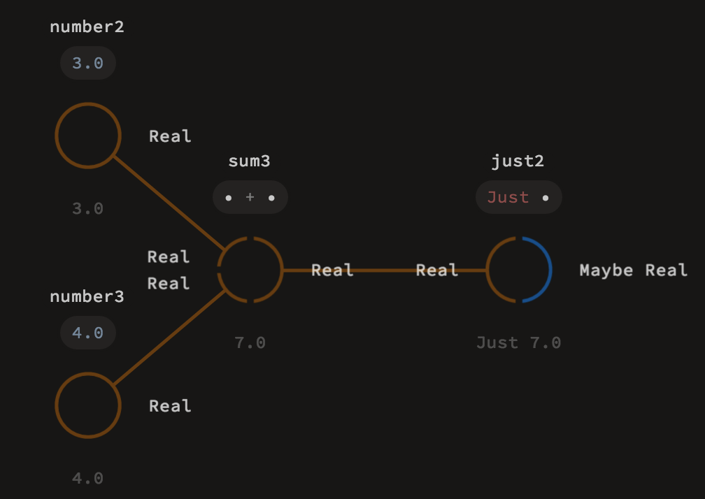

# Types

## What are types and why do they matter?

Different values in our programs represent different things. A value may represent a velocity, a question asked by the user to our chatbot or a collection of all the users in the system. Some operations, such as multiplication, make sense only for numeric values, others like reversing a list will work with any list, with no regard to the values of individual elements. Yet others, like summing a list will work with any non-empty list containing arithmetic elements, but we don't really care for the exact structure of the elements inside: they may be integers, fractions or even matrices – the common theme is just having an addition operation defined.

In this chapter we introduce types – Luna's facility to handle such descriptions. You'll learn how types are described, how to check a type of a given value and what happens when the expected properties are not satisfied by the values. The philosophy behind this system is to provide as much safety and useful hints as possible without restricting your expressive powers.

## How do I see types?

Luna differs from most typed languages in that you will never need to specify the types of values manually. The type of a given object is computed automatically by Luna's typechecker. This computation ensures that any operation can be safely performed, without any contradicting properties arising.

Since the types are usually not expressed in code, we need a way to show them to you. You have probably already noticed that the nodes in our visual editor come in different, seemingly random, colors. Those colors are just one of the ways the visual editor communicates types. Each of the ports on the node is assigned a color corresponding to its type. All the connections are also colored, the colors meaning the type of data "being sent" via this connection.

Colors are a great indication for some values being of different or same type, but it's not enough. Just imagine referring to them like "the text `"hello world!"` has type `magenta`". That's why the colors serve only as visual aids,   but the real types have a text representation. If you hover above a node, the real types are revealed. Each of the node inputs and outputs displays its corresponding type.

In the above image you can see the actual type names and thus understand the behavior of the node:

1. The nodes `number2` and `number3` don't have inputs – they are both constants of type `Real`,
2. The node `sum3` has two `Real` inputs and a `Real` output – it transforms two `Real` numbers into another `Real` number,
3. The node `just2` has a `Real` input and a `Maybe Real` output – it transforms a `Real` number into a `Maybe Real` value.